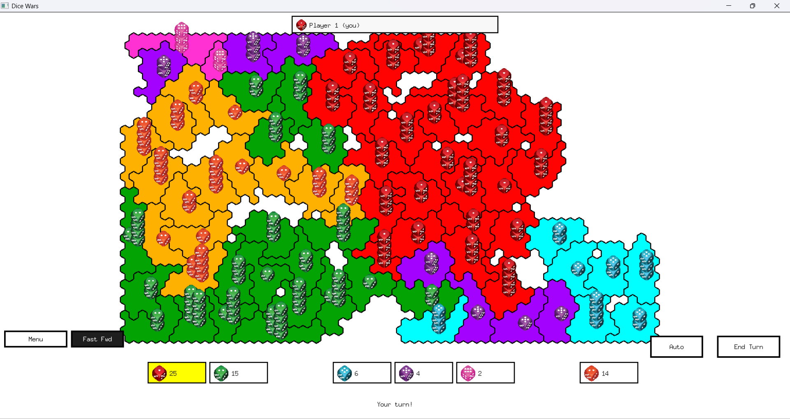
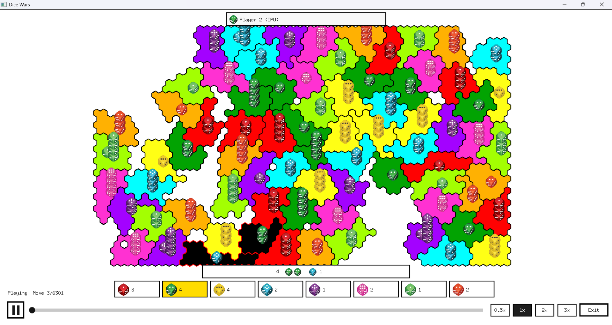

# Dice Wars

A remake of the classic Dice Wars Flash game by GAMEDESIGN. This version is built with Go and Ebiten.



## How to play

1. Choose the number of players (2-8). You are always player 1; the rest are CPU opponents.
2. Click **Start!** to begin.
3. On your turn, click one of your territories with **2+ dice**, then click an adjacent enemy territory to attack.
4. Dice are rolled for both sides; higher total wins. On victory, all but one die move to the conquered territory; on defeat, all but one die are lost.
5. At the end of your turn, click **End Turn** to receive reinforcements equal to your largest connected territory group.
6. Conquer the map to win.

If you lose all your territory before the game ends, an elimination screen lets you watch a replay of the game so far, restart, or return to the menu. When the game ends, a victory (or defeat) screen offers the same choices.

## Controls

- **Left click** - select territory / attack / UI buttons
- **End Turn** - finish your turn and receive reinforcements
- **Auto** - let the AI play your turn
- **Fast Fwd** - speed up AI turns
- **Menu** - return to the main menu
- **F11** - toggle fullscreen

## Replay

From the elimination or victory/defeat screen, click **Replay** to watch the game play back move by move.



- **Play/pause button** - toggle playback, or restart from the beginning once finished
- **Seek bar** - drag to jump to any point in the game
- **Speed chips** (0.5x/1x/2x/3x) - change playback speed
- **Exit** - return to the main menu
- **Space** - play/pause, **Left/Right arrows** - change speed, **Esc/Enter** - exit

## Build & run

Requires Go 1.26+.

```bash
go mod tidy
go run .
```
